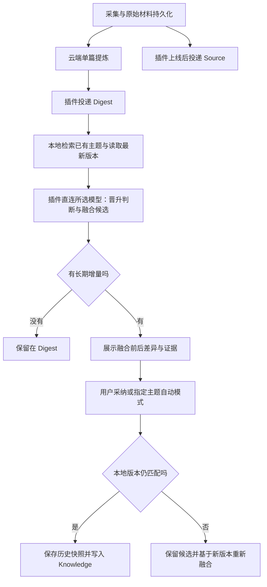

# Obsidian 三层知识库实现方案

日期：2026-09-09。版本：v2，云端提取提炼、本地知识整理。状态：待实施设计；本次只交付方案，不代表插件已支持三层整理，也未迁移实际 Vault。

> **部分内容已被取代（2026-09-22）**：本文件里“每条观点有稳定 `claim_id`”“`evidence_map` 走
> Knowledge→Digest→原文两跳”“融合输出 `added/updated/retired_claims` 与五维晋升判断”这些设计，
> 已由 [docs/23](23-ID与模型输出协议简化修改方案.md) 决定取消，字段级新契约见
> [docs/24](24-内容协议v3契约冻结与实施记录.md)：统一内容文档 `content.json`、四类内容块、
> 文档内 `e` 引用直接指向固定版本原文、本地整理改为“主题候选修改”。三层分工（Source／Digest／Knowledge）、
> 管理区与人工区保护、凭据边界继续有效。旧 `claim_id`、`evidence_map` 与旧摘要快照只作为历史数据被迁移
> 工具读取，不再是新写入格式。

目标：**01 Sources 保存原始证据，02 Digests 提炼单个来源，03 Knowledge 持续维护围绕长期问题的当前认知。** 第三层按主题融合、改写和修正，不按采集条目无限追加。

本文以当前仓库为基础，替代 [开发设计文档](02-开发设计文档.md) §12 中原来的笔记组织方案；同步、账号和原始材料留存继续复用现有实现。本版取消上一版的云端主题融合任务：关联已有知识、晋升判断、Obsidian 链接、第三层整理全部由本地插件执行。凭据增加“复用线上 Key 到本机”的明确使用边界。新增接口和字段均为拟议契约，实施时更新 OpenAPI。

## 1. 关键实施决定

| 问题 | 本方案的决定 |
| --- | --- |
| 原始材料与 AI 混放 | 拆成独立 Source 与 Digest；Source 正文不含 AI 总结 |
| 一条内容对应多少笔记 | 一个采集条目默认一个 Source、一个当前 Digest；Knowledge 可以零个或多个关联，但不逐条新建 |
| 什么可以晋升 | 以 Digest 中有证据的具体观点为单位判断，同一篇可以部分晋升 |
| 长期知识怎么更新 | 读取主题现有正文，产出融合后的替换稿、观点变化和证据映射；不是在文末追加摘要 |
| 默认自动化程度 | Source/Digest 自动入库；Knowledge 首版自动形成候选，由用户一次选择采纳、编辑或跳过。后续可对指定主题开启受限自动融合 |
| 关机时做到哪一步 | 云端继续采集和单篇提炼，可在网页查看；本地整理任务暂停，插件再次运行后恢复 |
| 本地整理调用模型 | 插件直接调用用户选定的模型服务，本地负责检索、提示词、校验、候选和写盘；使用远程模型时仍需联网 |
| 知识内容发送到哪里 | 本系统云端不接收 Knowledge、主题索引或本地整理任务；插件只把本次必要内容发给所选模型服务 |
| Key 如何选择 | 云端提炼选择线上配置；本地整理可复用该配置或选择另一线上配置 |
| 云端查看什么 | 单条目的原始信息、实际取得的原文／附件、云端单篇提炼；不展示或推断本地晋升和第三层内容 |
| 是否需要向量数据库 | 首版不需要：本地标题、别名、主题摘要与关键词检索即可 |

插件新增“整理知识库”功能，设置中分别显示“云端提炼模型”和“本地整理模型”。本地整理说明内容直接发往当前选定模型服务，流程和结果保留在本机。选择模型并启动整理后按此范围执行，不逐条弹确认。未启用本地整理时，云端提炼、网页阅读及 Source/Digest 投递照常工作。

## 2. Vault 目录与命名

```text
Vault/
├── 00 Inbox/
│   ├── 待回顾.md
│   └── 知识更新候选.md
├── 01 Sources/
│   ├── 2026/09/2026-09-09 Agent实践--item-demo.md
│   └── _assets/item-demo/source-000001/
│       ├── original-subtitle.srt
│       ├── normalized.md
│       └── segments.json
├── 02 Digests/
│   └── 2026/09/2026-09-09 Agent实践--item-demo.md
├── 03 Knowledge/
│   ├── Agent 操作技巧.md
│   ├── Agent 上下文管理.md
│   ├── AI 工作流设计.md
│   ├── 个人知识管理.md
│   └── 内容创作系统.md
└── 99 System/KnowledgeInbox/
    ├── bundles/           # 已下载的不可变 Bundle 与清单
    ├── commits/           # 入库回执和恢复记录
    ├── proposals/         # 晋升与融合候选
    ├── revisions/         # 被引用的 Digest、Knowledge 历史快照
    ├── migrations/        # 旧目录迁移清单与恢复状态
    └── knowledge-index.json
```

`00 Inbox` 和 `99 System` 是入口与运行记录，不是另外两层知识。附件放在 Sources 下以便一起归档，但不应把它们当成概念节点。

- Source、Digest 以采集日期分目录，文件名带稳定 `item_id`。采集后不会因 AI 改标题而自动改名；重名由 ID 区分。
- Knowledge 用稳定主题名，不加日期；机器用 `kb_id` 标识。中文名与英文概念通过 `aliases` 统一，不能仅因名称不同建两个节点。
- 第一批主题只在有内容时创建，不预建一批空文件填满图谱。一个主题讨论一个可复用问题；先用小节，确有多个独立子问题再拆文件。
- 路径由本地插件根据 ID 解析；模型返回 ID 和建议标题，不能直接决定写盘路径。
- 首版允许 Bundle 留存和可读原文存在少量重复，以减少投递改造复杂度；不在本轮引入内容去重存储。

## 3. 三层分别保存什么

### 3.1 Source：它原来说了什么

Source 笔记由来源元数据、完整性说明、对应 Digest 链接、原件链接、可读原文组成。正文优先嵌入本地 `readable.md`（相邻片段合并后的自然段落，见 docs/02 §6.4.1）；旧版本没有它时回退到逐片段的 `normalized.md`。不把摘要当正文。

| 来源 | 留存内容 | 必须说明的边界 |
| --- | --- | --- |
| 公众号／网页 | 实际取得的完整正文、可获得的原始文件及元数据 | 正文缺失时标记部分或仅元数据，不靠标题补写 |
| B 站 | 当前视频及分 P/cid 的完整字幕、时间戳、原字幕文件 | 字幕不等于视频画面；无轨则待补充，不添加 ASR |
| AI 对话／Agent | 实际导出的全部可见消息、角色、顺序、可取得的工具结果 | 截断导出标记部分；不承诺保存平台未提供的隐藏内容 |
| 小红书 | 实际取得原文／分享文本、原始截图；有 OCR 时另存识别文本 | OCR 是衍生转录，有识别误差；分享文本不冒充全文 |
| 个人灵感 | 用户原始表达及记录时间 | 标明个人记录，后续 AI 建议另放 Digest |

示意模板（ID 均为演示值）：

```markdown
---
kb_id: src-item-demo
kb_item_id: item-demo
kb_type: source
kb_source_revision: 1
kb_coverage: transcript_only
tags: [type/source]
---
# Agent 实践

来源：B 站；视频、分 P、cid、原地址和采集时间由采集元数据填入。
完整性：已取得该分 P 字幕，不含视频画面。
提炼：[[02 Digests/2026/09/2026-09-09 Agent实践--item-demo|查看提炼]]

## 原始材料
[[01 Sources/_assets/item-demo/source-000001/original-subtitle.srt|原字幕]]

## 完整文字稿
![[01 Sources/_assets/item-demo/source-000001/normalized]]
```

原始文件按 `source_revision` 不可变留存。补充字幕或修正 OCR 产生新版本；保留旧版本以维持证据链。Source 入口可以显示最新版本，但旧引用必须固定到当时的原文版本。原始字节留在原件，可读文本可加段落号和时间戳，不能静默改写原意。

采集备注保留为独立字段；用户后续思考放在 Digest 的人工区，不插入来源正文。用户确需编辑 Source 时，同样执行编辑保护，不能用重新下载覆盖。

### 3.2 Digest：这里面有什么值得留下

每条来源一个当前 Digest；重新提炼更新机器区，并保存被长期知识引用的旧提炼版本。

```markdown
---
kb_id: dig-item-demo
kb_item_id: item-demo
kb_type: digest
kb_source_revision: 1
kb_digest_revision: 1
kb_promotion: not_evaluated
tags: [type/digest]
---
# Agent 实践：提炼

来源：[[01 Sources/2026/09/2026-09-09 Agent实践--item-demo|原始资料]]

<!-- kb:cloud-digest:start -->
## 一句话总结
……
## 核心观点与证据
每条观点有稳定 claim_id、原文定位和适用条件。
## 值得保留的原文摘录
逐字摘录，并链接原文片段；没有合适摘录可以留空。
## 方法、适用条件与局限
仅围绕本条来源提炼，分开写来源主张与 AI 推断。
## AI 候选启发
明确标记推测，不当成已被原文证明的结论。
<!-- kb:cloud-digest:end -->

<!-- kb:local-organize:start -->
## 与已有知识的关系
首次投递显示“尚未本地整理”；本地整理后说明补充、重复、反驳或条件修正。
## 晋升建议
由本地插件填写拟晋升观点、目标主题、具体增量和理由。
<!-- kb:local-organize:end -->

## 我的备注与判断
此区域归用户管理。
```

云端输出仅含单来源摘要、核心观点、摘录、方法、适用条件、局限和明确标记的候选启发，不包含知识匹配、晋升评分／结论、主题 ID、标签或 Obsidian 链接。云端保留结构化 `claim_id` 与 `evidence_ids` 作为证据定位数据；网页可据此定位本条原文，这不是建立知识网络。Source/Digest 间的固定链接、证据块链接及类型标签也由本地插件渲染。

云端更新只替换 `kb:cloud-digest` 区，本地整理只替换 `kb:local-organize` 区，人工区归用户；三者单独记录哈希。新版云端提炼改变本地判断所依赖的输入时，将本地结果标为 `stale` 并排入本地复核，保留旧结果和已采纳证据快照，不能在同步时覆盖本地判断。

### 3.3 Knowledge：关于这个问题，我现在知道什么

一个主题既能吸收多个 Digest，一篇 Digest 也能支撑多个主题。篇幅以解释问题所需为准，不设增长配额；接近约 3,000–5,000 字时提示检查结构，而不是机械拆分。

```markdown
---
kb_id: kn-agent-operations
kb_type: knowledge
kb_revision: 3
kb_reviewed_at: 2026-09-09
aliases: [Agent操作技巧]
tags: [type/knowledge]
---
# Agent 操作技巧

## 这个主题解决什么问题
边界、适用对象，以及不在本篇展开的问题。

<!-- kb:knowledge:start -->
## 当前判断
按问题组织结论，每个重要结论附具体证据链接。
## 可执行的方法与适用条件
把多个来源的重复建议合并成清晰步骤。
## 分歧、反例与尚未解决的问题
并列记录不同主张、证据、适用场景和当前取舍。
## 与其他主题的关系
例如：上下文分配问题见 [[03 Knowledge/Agent 上下文管理]]。
<!-- kb:knowledge:end -->

## 我的实践与补充
用户经验、偏好和手动记录，自动融合不改写。
```

AI 融合可以重写整个受管理的主题正文，而不是固定每条 Digest 占一段。人工区、未知 frontmatter 和用户修改都要保护。用户在机器区直接编辑同样有效：一旦检测到偏离上次基线，就生成待合并稿，不静默覆盖。

“当前判断”在用户采纳后代表其接受的整理结果；未采纳候选不应假称“我已经验证”。个人实践也是一种证据，但必须与外部来源、AI 推断区分。

## 4. 晋升门槛：选观点，不搬整篇文章

本节及第 5–7 节全部在本地插件执行，不由云端 Worker 执行。

先检查材料和证据是否足以支持该观点，再评估长期价值。模型输出理由和离散等级，不把主观评分包装成统计置信度。

| 维度 | 要回答的问题 | 记录方式 |
| --- | --- | --- |
| 新颖性 | 是新观点，还是熟悉说法的重复？ | 无／有限／明显，附理由 |
| 实用性 | 能改变行动、判断或解释吗？ | 无／有限／明显，附适用场景 |
| 可信度 | 作者在主张什么，有什么证据，哪些没验证？ | 待核验／有依据／已交叉核验；最后一项需列出实际独立证据 |
| 可复用性 | 能否跨越当前文章或项目再次使用？ | 一次性／条件性／长期，附条件 |
| 认知增量 | 相对当前主题增加、修正或反驳了什么？ | 重复／补证／新增／修正／冲突，必须指定已有观点或缺口 |

按以下规则执行，不用简单加总分抵消证据缺陷：

1. 正文未取得、引用无法定位、推断冒充原文：暂缓该观点；原始资料照常保存。部分材料可以支撑其覆盖范围内的窄结论，不能推及全文。
2. 纯重复、无独立补证、无条件修正：留在 Digest，记 `keep_digest`。
3. 有可说明的长期用途，并新增方法、适用条件、独立证据、反例或实质冲突：进入 `review`。
4. 新事实依据不足时，最多作为“待验证问题／假说”候选进入主题争议区，不晋升成确定结论。
5. 未匹配已有主题时，只有主题边界稳定、预计能继续吸收不同来源、没有同义节点才建议新建；单个高价值来源也可提出候选，不硬性要求攒满两篇。

新增来源如果只是转载同一份研究或同一作者观点，不算独立验证。反例可以有价值，不能因为它与已有判断冲突而被“可信度”打低。

每个候选记录 `claim_id、decision、target_knowledge_id/new_topic、relation、reason、evidence_refs`。同一条摘要内，两个观点可以分别晋升、暂缓或跳过。

状态以候选记录为准：`review → accepted → applied`，或 `review → skipped`；暂缓用 `deferred`。`accepted` 是用户采纳，`applied` 才是实际写入成功。Digest 的 `kb_promotion` 只是汇总展示，允许 `partially_applied`，不能用一个整篇布尔值替代观点级状态。

## 5. 主题匹配、链接与标签

插件仅扫描 `03 Knowledge` 中的标题、`kb_id`、aliases、范围说明和检索关键词，建立可重建的本地索引。用户改名／移动笔记时按 ID 更新映射，索引丢失可重新扫描。

匹配顺序：精确标题和别名 → 关键词及范围检索 → 取最多约 5 个候选在本地判断相关性 → 为本次融合读取最相关主题正文。初始数量是可调整的实现参数，不是质量保证；匹配模糊时列候选，不强行归类。检索不需要把所有主题发给模型。

- Source 主要链接对应 Digest 与原件；Digest 链接 Source 和确有关系的 Knowledge。
- Knowledge 之间只在正文关系明确时加链接，并说明是前提、应用、补充还是冲突。
- 模型输出候选 Knowledge ID，插件只将已解析到真实笔记的 ID 渲染为链接。新概念先用普通文字写入建议；节点实际创建后再建立链接。
- 通常每篇 Digest 先控制在 0–3 个真正相关主题，不为凑数量加链接；Knowledge 不设强制链接数量。
- `tags` 管类型与处理状态，例如 `type/source`、`type/digest`、`type/knowledge`、`status/review`。正文主题使用链接，内部检索词不自动变成标签。
- 标签更新只增删系统管理的标签，保留用户其他标签；`kb_*` 是机器状态，`status/*` 是它的展示，不能双向独立维护而逐渐不一致。

`[[链接]]` 建立引用，Obsidian 提供反向链接视图；不需要为了“看起来双向”在每个目标文件机械补一条返回链接。完整路径和别名显示可避免重名，例如 `[[03 Knowledge/Agent 上下文管理|上下文管理]]`。[Obsidian 内部链接文档](https://obsidian.md/help/links)

Graph View 的 Search files 设为 `path:"03 Knowledge/"`，关闭 Tags 和 Attachments，开启 Existing files only；只展示长期主题及其现有连接。待回顾列表由插件输出普通 Markdown，无需先安装 Dataview。[Graph View](https://obsidian.md/help/plugins/graph) · [搜索语法](https://obsidian.md/help/plugins/search)

## 6. 证据链与观点冲突

### 6.1 引用精确到观点与原始片段

Knowledge 的重要结论不能只有文末一串文章名。每个结论有稳定 `claim_id`，引用记录至少包含：

```text
knowledge_id + knowledge_revision + claim_id
  → digest_id + digest_revision + digest_claim_id
  → item_id + source_revision + segment_id
```

正文显示易读链接，系统保存上述 ID 映射。例如知识结论链接到 `99 System/.../revisions/digests/<id>/r000001#^c0001` 的冻结 Digest 证据块，该块再链接 `01 Sources/_assets/<item>/source-000001/normalized#^s0001`；旁边可另设“当前 Digest”入口。用户看到的是“依据：Digest 标题”，无需阅读系统路径。

`claim_id` 由 `key_points` 分配（格式 `c` + 4 位数字，如 `c0001`）。`excerpts` 的 `claim_id` 是**引用**，必须指向同一份输出里某条 `key_points` 已有的 `claim_id`，可以重复（表示给同一观点补充多条摘录）；`evidence_map` 按该 ID 把摘录合并进观点条目，不为其另开条目。摘录不占独立 ID，否则观点与它的摘录在证据链上会被拆成两条。

普通阅读以当前 Digest 为主，正式支撑链以固定版本为准。重新提炼不能使旧知识的依据悄悄变化；删除或替换一个已有观点时，记录它是被哪条观点取代，旧锚点留在历史快照。已有 Knowledge 观点的 ID 在含义不变时保留，不能每次融合全部重编号。

原文片段保存段落／字幕时间／消息角色与消息 ID／图片 ID。块引用用 `#^id`，块 ID 只用拉丁字母、数字和连字符；具体格式遵循 [Obsidian 块链接](https://obsidian.md/help/links)。

所有历史正文引用通过本地 ID 解析器生成，禁止直接信任模型生成的路径。代码校验引用存在、版本一致、引文确实出现；这些只能证明可追溯，不能证明语义正确。语义是否忠实仍需采纳时检查和抽样复核。

### 6.2 冲突必须保留，不自动平均

以“Agent 应高度自主”和“Agent 必须严格受控”为例，融合稿应包含：

- 主张 A：支持较高自主权，证据是什么、在哪类任务成立。
- 主张 B：要求严格控制，证据是什么、约束和失败代价是什么。
- 关系判断：若资料支持场景差异，写明差异；资料不足时写“尚不能判断”，不要自行编造调和条件。
- 当前取舍：用户已接受的判断及其依据；AI 提出的取舍明确标为候选。
- 待验证问题：还需要哪类实践、反例或测量。

涉及推翻用户当前判断、删除已有结论、主题拆分／合并的候选，保留差异预览供采纳。系统不以“已有来源数量更多”自动判胜负。

## 7. 自动融合的完整流程



### 7.1 输入与输出

一次主题融合输入包括：目标主题 ID、当前正文与哈希、当前观点证据映射、选中的 Digest 观点与版本、对应原文片段、用户锁定的区域及用户对本次更新的明确要求。同一主题同时到达的多个 Digest 尽量合成一个任务；不同主题分开提交，避免多文件大事务。

输出至少包含：`base_hash、proposed_managed_body、added/updated/retired_claims、evidence_map、conflicts、change_summary、promotion_decisions`。模型必须交代旧观点保留、合并、修正或退休的去向，不能为了压字数无声删除不相关内容。没有变化返回 no-op。

融合提示词核心约束：

> 维护该主题的当前认知，围绕问题重新组织正文。只吸收通过晋升门槛的增量，消除重复，保留适用条件和实质冲突。保留仍有效的旧观点及其证据。新推断与来源主张分开。不得改写人工区域，不得凭空补证据或新建主题链接。输出替换稿及逐项变更依据。

### 7.2 写入、重试与保护

1. 插件为每个主题串行处理候选；任务记录 `proposal_id`、输入 Digest/Source 版本、主题基线哈希和规则版本。同一次提交重试沿用幂等键，相同 ID 不重复应用。
2. 插件先在本地持久化任务输入、模型配置引用和调用状态，再直接调用选定模型；不经过本系统云端。每个任务固定当次配置版本，Key 不写进任务文件。请求已发出但结果未落盘时标记 `unknown_outcome`，保留显式重试入口，不能因插件重启盲目再次调用。
3. 插件收到模型返回后完成 Schema／证据校验；保存本地待采纳稿和输入基线。用户可查看“新增了什么、删改了什么、依据是什么”，再采纳、编辑或跳过。
4. 写入前检查最新主题正文与相关输入版本。用户或同步工具改过笔记就标记候选过期，重新生成或人工合并，不直接覆盖。
5. 先写历史快照与恢复记录，再在一次读取—比较—修改操作中替换管理区，保留人工区和未知字段。哈希计算若在回调外完成，回调内还需比较实际文本，防止检查与写入之间被编辑。
6. 写入成功后记录新哈希、证据映射、已应用候选 ID，最后标记提交完成；崩溃后根据前后哈希和恢复记录识别已经写入、尚未写入或冲突，不能重复追加。
7. 回滚以历史版本生成恢复操作；若当前笔记已再次修改，先展示差异，不能直接用旧快照覆盖新人工内容。被现有结论引用的 Source／Digest 快照不按普通缓存清理。

第三方同步不是跨设备事务锁；首版每个 Vault 指定一台本地整理设备，设备启用状态不随 Vault 同步自动开启。换机后先停止旧机整理、恢复本地日志并检查版本。服务器的 `consumer_epoch` 继续用于云端投递，不用它给本地整理增加账号在线依赖。已保存的候选可在离线时采纳；新模型调用需要模型服务可达。本系统服务器不可达时，已配置独立本地 Key 的整理仍可运行。

首版为“自动准备、一次采纳”。后续指定主题开启自动模式时，只应用无冲突、证据通过校验且不删除／反转已有判断的更新；新建节点、冲突、用户改动仍进入候选列表。这个流程不增加采集时的步骤。

## 8. 本地整理、模型配置与云端阅读

| 模块 | 负责的工作 |
| --- | --- |
| 现有 API + Worker | 原始内容保存、抽取、分块、单篇 Digest 生成、线上模型凭据与配置；提供条目阅读和所选 Key 的设备绑定能力 |
| 插件 | 三层路径、全部 Obsidian 链接、本地模型配置、本地主题检索、晋升判断、融合调用、候选展示、校验、落盘和回滚 |
| 服务端 SQLite | 保持采集、提炼、投递及配置状态；不增加 Knowledge、主题索引或本地融合任务表 |
| Vault | 当前三层正文、长期证据与历史、人工修改；Knowledge 的最终权威版本在本地 |

### 8.1 插件“整理知识库”入口

插件提供侧栏入口与命令“整理当前 Digest”“整理待处理内容”“查看知识更新候选”。主要界面：

```text
整理知识库
本地整理模型：当前配置名称 / 模型名       [修改]
范围：当前 Digest / 未整理与已过期条目 / 手动选择
[开始整理]  [暂停]

待处理 → 正在整理 → 待采纳 / 留在 Digest / 失败待重试
候选：目标主题、认知增量、前后差异、原文依据
[采纳]  [编辑后采纳]  [跳过]
```

默认用户点击开始，另提供“新 Digest 入库后自动准备整理候选”开关。后台准备不等于自动写入第三层；第三层是否自动应用仍按指定主题的设置执行。初期模型请求串行运行，暂停后不发新请求，已返回结果及时保存。

本地任务保存在 `99 System/KnowledgeInbox/` 下，输入和结果含版本、基线哈希、模型配置 ID、规则版本和状态。没有目标主题时先生成新节点建议，实际创建时由插件分配 ID。晋升与第三层应用状态只在本地显示，不上传云端，也不复用云端“已入库”字段。

### 8.2 云端提炼与本地整理分别选模型

```text
模型设置
云端提炼： [线上配置 A ▼]              [管理线上配置]
本地整理： [与云端提炼使用同一配置 ▼]
           - 与云端提炼使用同一配置
           - 选择另一线上配置 B
           - 使用本地独立配置 C

本地独立配置：名称、API Base URL、模型、API Key
[测试本地连接]  [保存]
```

- 线上默认值继续由 `/v1/settings.default_profile_id` 决定；单条目选择继续使用已有 `processing_profile_id`。本地读取哪个 Digest，不影响它使用哪个整理 Key。
- 本地配置增加 `mode=follow_cloud|cloud_profile|local_profile`。`follow_cloud` 跟随云端默认配置；`cloud_profile` 固定一个本人线上配置 ID；`local_profile` 固定本机配置 ID。切换本地模式不会修改云端默认值。
- 本地独立配置只在本机保存，不自动上传；线上用 A、本地用 B 是完整支持的正常组合。Key 之外还必须确定 endpoint、model 和能力参数，不能只记一个 Key。
- “同一配置”以一次已同步版本为准：整理批次开始时读取最新线上配置并固定该版本。线上默认值、Key 或 endpoint 改动后，下一批次更新，进行中的任务不切换。无法确认线上配置时显示“等待配置同步”，不静默换 Key；用户可主动切到独立本地配置。
- Key 失效只暂停该配置的任务，不能回退到另一配置或另一用户。云端重新提炼和本地重新整理是两个独立按钮。

“线下”在这里指本地插件执行。使用远程模型 API 时，必要的 Digest／Knowledge 内容会直接发送给模型供应商；这不意味着完全离线或数据不出电脑。本系统云端不接收这些本地请求的正文和结果。

### 8.3 复用线上 Key：向本人设备绑定，再由本地直连模型

当前 `routes_profiles.py` 明确“凭据只进不出”，普通配置读取只提供 endpoint、model、configured 与版本，没有可用于本地调用的 Key。因此“复用线上配置”不能只复用配置 ID，也不能用云端主题任务或模型转发冒充本地执行。

为实现用户要求，新增受控的设备绑定接口。这是对既有凭据策略的明确变更：**普通读取仍不返回密钥；用户在插件选择复用某个线上配置时，允许将该配置的 Key 下发到其当前设备，用于本地直接调用。** 绑定动作在设置中说明“将此 Key 配置到本设备”，不在每次整理时重复询问。

拟议接口：`POST /v1/provider-profiles/{profile_id}/local-binding`。要求本人已登录的有效桌面设备、专用 `profiles:bind-local` 权限，并校验配置与设备都属于当前用户。该权限通过用户选择绑定时的设备授权获得，不能仅因旧设备具有普通 `profiles:manage` 就自动获得导出能力。

接口经 HTTPS 返回 `profile_id、profile_version、credential_version、endpoint、model、capabilities、secret`；响应禁止缓存，网关和应用日志不得记录响应体或 secret。模型配置列表、条目接口、网页 DOM 和普通同步 Bundle 均不包含 Key。绑定授权关联设备与配置，后续仅为该绑定更新版本；切换到另一个配置需要建立对应绑定，不扩大成任意凭据导出。

插件将 Key 存入经验证可用的本机秘密存储，普通配置只保存引用，禁止进入 Vault 笔记、任务 JSON、同步的 `data.json` 或日志。当前 `SecretBridge` 是服务 Token 专用且带 `data.json` 降级，新 API Key 管理不得直接套用该明文降级；秘密存储不可用时提供会话内使用方式，重启后重新配置，不阻塞原始资料同步。

本地独立配置使用相同的秘密存储规则。解绑只删除本机绑定和该本机秘密引用，不替用户撤销线上或供应商 Key；断开账号时清理该账号导入的线上 Key，本地独立配置保持独立。线上换 Key 后，下次配置同步替换本地副本；服务端撤销绑定会阻止再次领取，但无法远程收回已经下发的供应商 Key，彻底失效需在供应商处撤销。设置页用这一实际语义说明绑定状态，不能承诺远程擦除。

上线前须同步修改开发设计中的“凭据只进不出”说明及对应接口测试；已有用户尚未选择本地绑定时维持原有行为。

### 8.4 云端条目详情：原始资料与云端提炼都能直接看

扩展现有 Web 收件箱的条目详情为两个主要阅读页签，并保留处理状态和版本信息：

| 页签／区域 | 展示内容 |
| --- | --- |
| 原始资料 | 标题、作者、平台、来源 URL、采集时间、分 P/cid 等定位、覆盖与缺失说明、用户原始备注；实际取得的全文／完整字幕／对话；原始截图及可用 OCR 另列；原件下载 |
| 云端提炼 | 一句话总结、核心观点、原文摘录、方法与适用条件、局限、AI 候选启发；显示对应来源版本和生成时间，可定位本条原文片段 |
| 状态与操作 | 提取／提炼中、等待材料／Key、失败与可用旧版本；补充材料、重新提取、重新提炼、下载。无需进入 Obsidian 才能阅读 |

云端页面不显示“关联 Knowledge”“是否晋升”“第三层整理”，也不从投递回执猜测这些本地状态。网页上的“查看原文”和段落定位是条目阅读导航；Obsidian 双链、主题链接、标签网络仍全部由本地生成。

当前 `inbox.html::openDetail` 主要显示元数据与动作，`loadExport` 提供清单文件下载，尚无此完整阅读布局。可复用现有 `/v1/items/{id}` 和 Bundle manifest/files 路由加载 `normalized.md`、原件及 `content.json`，不再生成一份新的 AI 结果。阅读视图按 v3 内容块渲染，引用直接指向同版本原文（docs/24 §6）；只有旧 `analysis.json`/`preview.md` 的条目由转换层当场给出 v3 视图并标注为旧版内容。

版本选择必须显式：当前 Source r2 尚在提炼时，显示 r2 原文及“现有提炼基于 r1”的提示；点击旧提炼证据打开 r1，不能错配 r2 的段落。尚无提炼时仅显示“待提炼”，原文依然可读。长文本按段落逐段加载，完整内容可继续展开，不将截断预览标成全文。

所有读取沿用当前用户及 Item/Bundle/File 归属校验；外部内容只作为文本或经过清理的阅读内容，不执行原始 HTML，不渲染模型生成的脚本与命令。附件通过已鉴权文件路由读取，图片不任意加载远程追踪资源。

阅读范围是服务器仍留存的条目材料。保留现有保留期与删除策略，详情显示到期时间；过期后如实显示“云端材料已过期，本地已下载材料仍可查看”，不假装能够从 Vault 回读。若以后要求云端永久历史阅读，应另行调整存储政策；本次不默认为长期云盘。

### 8.5 契约边界

继续复用 provider-profiles/settings 与 Item/Bundle/File 读取接口，新增本地 Key 绑定及必要的绑定撤销接口。服务端不新增 `/v1/knowledge-proposals` 及其回执接口；上一版提出的云端融合存储与 7/30 天候选保留期取消。

本地整理契约由 TypeScript 模块定义：任务、候选、观点证据映射、配置引用与提交记录。被现有 Knowledge 引用的 Digest 和 Source 快照随本地证据留存；未采纳候选可在本地清理，但不得随服务器 Bundle 到期删除。云端数据已过期时，本地可完全基于已下载原文和提炼继续整理。

## 9. 当前代码的改造落点

2026-09-09 已查看当前实现：Source 模板包含 `AI 加工` 生成区，默认目录为 `10 Sources`，提交记录只有一个 `note_path`；AI Schema 为 `1.0`，已有观点和片段 ID 校验，但没有本方案的晋升／Knowledge 融合契约。

| 位置 | 改动 |
| --- | --- |
| `apps/server/kbserver/domain/templates.py` | 单篇提炼增加摘录与适用条件；云端提示词不输出知识关联、晋升、主题链接和标签 |
| `apps/server/kbserver/domain/analysis.py` | 云端新版 Schema、claim ID、摘录一致性校验；产物保存结构化证据 ID，不生成 Obsidian 双链；旧版读取兼容 |
| `apps/server/kbserver/workers/enrich.py` | 发布新版单篇 Digest，保留原始材料与旧版本；不实现本地整理任务 |
| `apps/server/kbserver/api/routes_profiles.py`、`routes_auth.py`、`security/tokens.py` 及必要模型迁移 | 线上配置选择、专用本地绑定权限及本人设备 Key 下发／解绑，普通读取继续隐藏凭据 |
| `apps/server/kbserver/web_static/inbox.html` 及现有条目／投递读取接口 | 增加原始资料和云端提炼阅读页签，证据定位、版本差异、加载／失败／过期状态 |
| `apps/obsidian-plugin/src/settings.ts`、`types.ts` | 三层目录、线上／本地分别选配置、本地秘密存储引用、整理开关、Schema 版本和分区提交信息 |
| `apps/obsidian-plugin/src/vault/template.ts`、`paths.ts` | 拆分 Source/Digest 模板、Knowledge 模板与 ID 路径解析 |
| `apps/obsidian-plugin/src/sync/engine.ts`、`vault/records.ts` | 多笔记可恢复提交、每篇独立哈希、历史快照与来源版本固定引用；失败不标记已全部完成 |
| `apps/obsidian-plugin/src/main.ts` 及新 `knowledge/`、`providers/` 模块 | 本地模型直连、晋升／融合提示词与校验、持久化任务、本地索引和链接、整理面板、采纳／跳过／回滚 |
| `contracts/` | 云端分析输出与设备 Key 绑定接口更新 OpenAPI；本地整理／模型配置／提交记录单独版本化，不冒充服务端接口 |

原始 Bundle 即使尚无 AI 结果，也可先提交 Source；Digest 未生成时界面显示待加工。已有 Digest 时 AI 失败保留旧版并标注状态；不能生成一份看似有效的空摘要。Bundle 的投递回执只要求本版本承诺交付的文件／笔记已完成，不等待未来 Knowledge 晋升。

## 10. 现有 Obsidian 内容如何迁移

迁移作为独立命令，先输出文件级预览；不能通过改默认目录让旧库下次同步自动复制一遍。

1. 按 `kb_id` 和本地提交记录盘点旧 `10 Sources`。识别来源元数据、AI 管理区、人工备注和现有附件；记录原路径、哈希及所有拟写入路径。
2. 新版安装对新库使用三层默认值，对已安装用户保留当前路径直到显式执行迁移。迁移先备份受影响笔记和提交记录，记录布局版本。
3. 对可明确识别的旧笔记，拆出新 Source 和 Digest；旧单篇 AI 区映射到云端提炼区，本地整理区初始为未整理；人工备注原样进入 Digest 人工区。用户改过生成区则保留该内容并标记待检查，不重新生成替换它。
4. 旧路径先保留简短跳转入口；若其标题／块锚点被引用且无法安全重写，则保留原文件作为历史，不用跳转替换而破坏引用。批量重写只处理可准确解析的链接，先列入迁移预览。
5. 旧 `90 Assets` 原件暂留原地并由新 Source 链接，不为统一目录冒险搬动。新采集按新目录写；后续有需要再单独迁移附件。
6. 升级提交记录，使旧 `(item_id, bundle_revision)` 对应新 Source/Digest 路径、各自哈希和布局版本；迁移重跑使用同一记录，不能重复生成。
7. 无法自动识别的历史普通笔记先保持不动。纯引用可作为 Source；纯个人长期认知可由用户选为 Knowledge 种子；混合笔记先提出拆分建议，不自动判定全文都是原文或 AI 结果。
8. 用一个小批次检查原文、手工内容、链接、重复导入与中断恢复后，再执行剩余迁移。整个迁移不自动删除旧原件，必要时可按日志恢复。

旧资料不会因为移动目录就自动成为长期知识。迁移完成后仍按同一晋升门槛筛选，优先处理用户正在使用的主题，避免全历史一次性调用模型。

## 11. 开发阶段与验收

**实施状态（2026-09-09）**：阶段 A（服务端，commit `865eaf9`）与阶段 B/C（插件，本轮）已实现；
阶段 D 为后续增强，未实施；§10 旧库迁移按用户要求本轮不实施（设置面板与代码中均无迁移入口）。

| 阶段 | 交付物 | 完成判据 | 状态 |
| --- | --- | --- | --- |
| A：云端单篇提炼与阅读、三层存储 | 收紧云端 Schema、Web 原文／提炼阅读、Source/Digest 拆分与分区保护 | 云端可读实际原文和提炼；不产出关联／晋升／双链；重复同步无重复笔记，人工和本地整理区保留 | 已实现（旧库迁移除外） |
| B：本地模型与整理入口 | 本地独立配置、线上 Key 绑定、配置分选、直连模型、本地任务、索引与观点级 Gate | 线上 A／本地 B 与复用线上 A 都可运行；本地正文不经过本系统服务器；重复观点留在 Digest | 已实现 |
| C：长期知识融合 | 本地融合候选、差异、证据快照、采纳、恢复／回滚 | 同一主题多篇合并后无机械追加；冲突保留；重要结论能两跳回到当时原文 | 已实现 |
| D：日常使用优化 | 同主题批量处理、指定主题自动模式、回顾入口 | 收集过程不增加分类操作；过期候选不会覆盖最新笔记；自动模式只在已选范围生效 | 未实施 |

阶段 A 不应标为“完整三层系统已完成”；本需求的最小完整闭环到阶段 C，阶段 D 为后续增强。每阶段集中做相关验证，不反复跑全量测试。

### 11.1 阶段 B/C 插件落点（本轮实施）

| 文件 | 内容 |
| --- | --- |
| `src/providers/local.ts`、`src/providers/transport.ts` | 三种本地模型模式解析、线上版本固定、直连 OpenAI-compatible 服务、错误分类、连接测试 |
| `src/knowledge/index.ts` | 扫描 `03 Knowledge` 建立可重建索引（标题／`kb_id`／aliases／范围／关键词），匹配顺序与候选上限 |
| `src/knowledge/prompts.ts` | 晋升门槛五维度提示词与校验、融合提示词与校验（基线哈希、证据链完整性、退休说明、ID 沿用） |
| `src/knowledge/citations.ts` | 冻结 Digest 证据快照、`#^c0001` 块锚点、两跳引用渲染、证据映射可追溯校验 |
| `src/knowledge/organize.ts` | 任务持久化与幂等键、串行批处理、`unknown_outcome` 显式重试、基线保护、候选落盘、采纳／跳过／回滚 |
| `src/views/organizePanel.ts` | 整理面板（范围、开始／暂停、状态分组、候选差异与采纳操作） |
| `src/main.ts` | 命令「整理当前 Digest」「整理待处理内容」「查看知识更新候选」、线上 Key 绑定／解绑、本地模型设置接线 |
| `src/vault/template.ts` | 三层模板与分区读写、系统标签只增删 `type/*`／`status/*` |

验证：`scripts/smoke.ts` 75 项纯逻辑断言全过（含两跳证据链端到端、基线变化拦截、回滚保护、
模型直连与错误分类、结果未知不重发）；`tsc --noEmit` 通过；生产构建 `main.js` 成功；
服务端 `tests/integration` 114 项全过；`contracts/openapi.json` 重导（含 reading 与 local-binding）。

未实测（需真机与真实 Key）：Obsidian 内实际登录授权、线上 Key 绑定到设备、真实模型服务的
晋升／融合调用、真实 Vault 的候选采纳与回滚、`prefers-color-scheme` 外的面板外观细节。

关键验收场景：

- 同一视频补充新字幕后，Source 有新版本，Digest 可重新提炼，旧 Knowledge 的引用仍打开旧字幕片段。
- 纯重复来源不改主题正文；真正独立的补证可以更新证据而不增长篇幅。
- 融合过程中用户编辑主题，旧候选被拦为过期；人工区和直接编辑过的机器区均未被覆盖。
- 两个候选同时针对同一主题，只能基于当前版本依次应用；进程在落盘后、提交标记前终止，恢复后不会重复处理。
- 两个来源冲突时，主题保留各自依据和未解决的问题，没有被压成“适度即可”。
- 相同概念的中英文名称复用同一个主题；不为单篇文章标题新建 Knowledge。
- 正文未获取、只有 OCR 或只有部分对话时，覆盖说明真实；无依据的观点不能被自动晋升为事实。
- 电脑关闭时云端原始资料与 Digest 仍能完成并在网页阅读；本地整理暂停，插件重启恢复队列，不重复调用结果不明的任务。
- 云端更新 Digest 只改云端区；本地关系、晋升结果及人工内容保留，依赖旧输入的本地结果正确标为过期。
- 本地用独立 Key 时，即使本系统服务器不可达，仍可针对已下载资料调用所选供应商整理；采纳已保存候选不要求服务器登录。
- 验证线上 A／本地 B、复用线上 A、跟随默认配置变更、Key 失效与换 Key；任务不静默换配置，Key 不进入笔记、普通配置、Bundle、任务日志或网页。
- Key 绑定拒绝其他用户的配置、无专用授权和已撤销设备；普通读取接口依旧不返回 Key；解绑与供应商撤销的含义正确区分。
- 通过模型调用测试替身及请求目标检查，验证本地整理直接发往选定模型服务；本系统服务器未收到主题正文、候选结果或本地晋升状态。
- 网页原文／提炼视图覆盖全文、部分资料、等待提炼、旧提炼对应旧来源、失败与到期；跨用户文件不能读取。

日常操作应收敛为：照常采集 → 自动得到 Sources/Digests → 打开“知识更新候选”看变化与证据 → 一次采纳 → 在 Knowledge 中阅读当前认知。回顾时优先检查争议、过时结论和待验证实践，不以节点数、链接数或新增字数作为成功指标。
